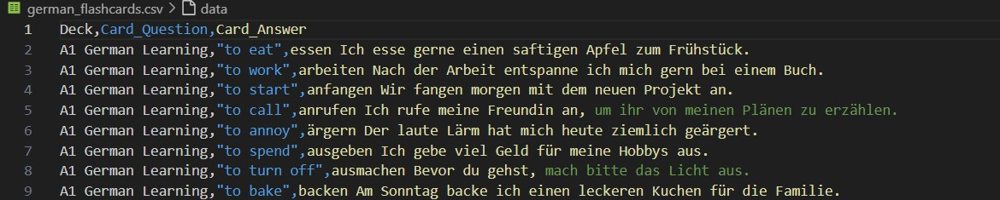

### Using AI to Generate the CSV File for AutoAnkiCards

Creating flashcards can be even more efficient by leveraging AI to generate the CSV file. AI can help you extract key information and format it appropriately for AutoAnkiCards. Here’s how you can use AI to automate this process:

#### Step 1: Prepare Your Source Material

Gather the source material you want to convert into flashcards. This can be in the form of text documents, PDFs, lecture notes, or even web pages. Ensure your material is clear and well-organized to facilitate the AI's extraction process.

#### Step 2: Choose an AI Tool

There are several AI tools and platforms available that can help with text extraction and generation. Some popular options include:

- OpenAI's GPT-4 (via the OpenAI API)
- Google's BERT
- Hugging Face transformers

For this guide, we'll use OpenAI's GPT-4 as an example.

#### Step 3: Extract Key Information

You can use AI to extract key information from your source material. For instance, you might want to generate questions and answers from a textbook chapter. You can prompt the AI with specific instructions to create a list of questions and answers.

**Example Prompt:**

Please extract key concepts from the following text for my flash cards and generate questions and answers for each concept:

[Insert your source text here]

Format the output as follows:

Deck,Card_Question,Card_Answer
DECK_NAME,Card_Question,Card_Answer
DECK_NAME2,Card_Question2,Card_Answer2

#### Step 4: Generate the CSV File

Once you have the questions and answers, you can format them into a CSV file that AutoAnkiCards can use.

EXAMPLE OUTPUT:

